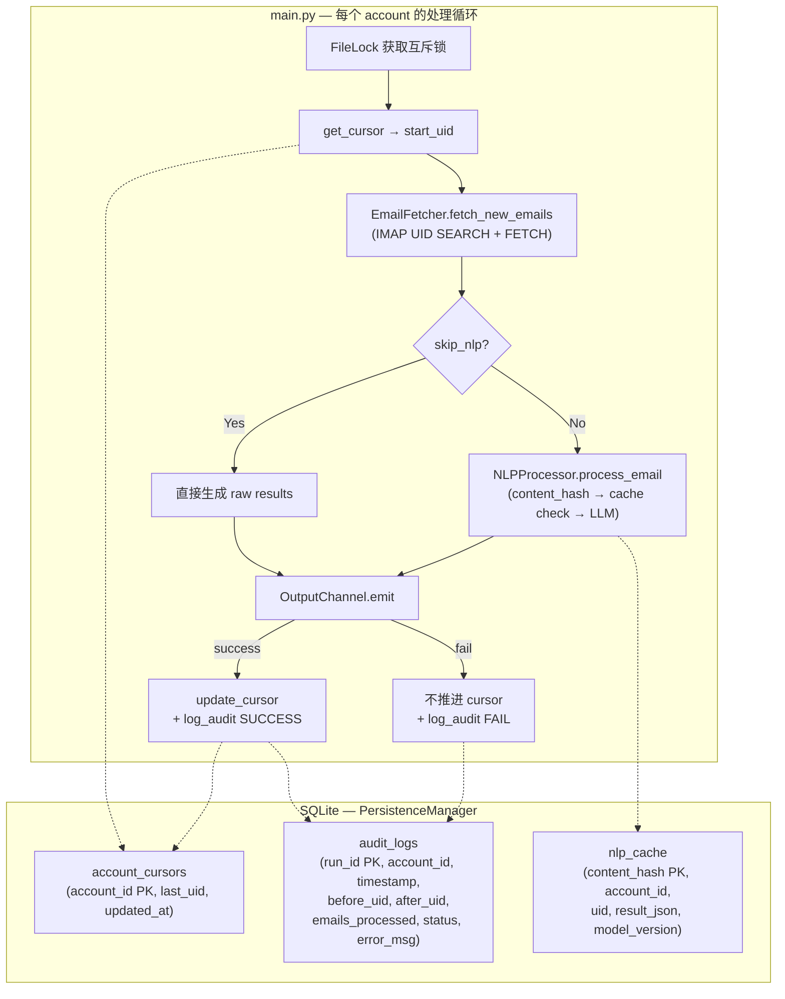

# Email Ingest Persistence & Idempotency 分析

> **文档类型：** 技术分析 (Technical Analysis)
> **创建日期：** 2026-04-05
> **状态：** 已实施 — 基于本分析的优化方案已落地，详见 [nlp_cache_implementation.md](./nlp_cache_implementation.md)

---

## 1. 当前持久化架构总览



### 核心设计原则
当前采用的是 **"all-or-nothing cursor advance"** 模型：

| 属性 | 实现方式 |
|---|---|
| **幂等性保证** | cursor 仅在 `emit` 成功后才推进；失败时 cursor 不动，下次重跑会重新拉取相同 UID 范围 |
| **互斥** | `FileLock` 防止 cron job 重叠 |
| **审计** | 每次 run 写一条 `audit_logs`，记录 before/after UID |
| **粒度** | **整个批次**——一批邮件要么全部成功推进 cursor，要么全部回退到上一次 cursor |
| **NLP 缓存** | 基于 content-hash 的 LLM 结果缓存，避免重复调用 |

---

## 2. Idempotency 保证的精确边界

当前的幂等性保证是**正确的**，但作用范围是粗粒度的：

```
cursor = 100
↓ fetch UID 101-110 (10封邮件)
↓ NLP process 全部10封 (cache miss → 调用 LLM; cache hit → 跳过)
↓ emit → 成功
↓ update_cursor(110)  ← 原子推进
```

**故障场景分析：**

| 崩溃点 | 重跑行为 | 幂等？ | NLP Cache 效果 |
|---|---|---|---|
| fetch 成功，NLP 第5封崩溃 | 重拉 UID 101-110 | ✅ 幂等 | ✅ 前4封命中缓存，跳过 LLM |
| NLP 全部完成，emit 失败 | 重拉 UID 101-110 | ✅ 幂等 | ✅ 全部命中缓存，0 次 LLM 调用 |
| emit 成功，cursor update 前崩溃 | 重拉 UID 101-110 | ✅ 幂等 | ✅ 全部命中缓存 |
| Poison pill 在第3封 | cursor 推进到 110 | ⚠️ 有争议 | ✅ 无浪费 |

---

## 3. 重复执行的成本分析

按照成本从高到低排列每个阶段的重做代价：

| 阶段 | 单次成本 | 重做可避免性 | 当前状态 |
|---|---|---|---|
| **LLM API 调用** | ⭐⭐⭐⭐⭐ | **已避免** | ✅ NLP cache 命中 |
| **IMAP FETCH** | ⭐⭐⭐ | 接受重复 | 🟡 设计决策 |
| **IMAP SEARCH** | ⭐ | 不需要避免 | ✅ |
| **emit (console/file)** | ⭐ | 不需要避免 | ✅ |

---

## 4. 已评估的优化方案

### 方案 A：Per-Email Processing Ledger

在 SQLite 中引入 **逐封邮件的处理状态表**，将粗粒度 cursor 细化为 per-message 级别。

```sql
CREATE TABLE IF NOT EXISTS email_processing_log (
    account_id   TEXT NOT NULL,
    uid          INTEGER NOT NULL,
    stage        TEXT NOT NULL,  -- 'fetched' | 'nlp_done' | 'emitted'
    result_json  TEXT,           -- NLP 结果缓存
    content_hash TEXT,           -- 邮件内容指纹
    created_at   TIMESTAMP DEFAULT CURRENT_TIMESTAMP,
    PRIMARY KEY (account_id, uid)
);
```

**评估：** 功能最全但改动最大。在接受 IMAP fetch 重复开销的前提下，方案 D 足以解决核心问题。

### 方案 B：Content-Hash 去重层

**评估：** 已采纳作为方案 D 的 cache key 策略。

### 方案 C：Two-Phase Cursor with Micro-Checkpoints

**评估：** 方案 D 已覆盖其核心价值，未单独实施。

### 方案 D：NLP Result Cache（✅ 已实施）

独立于 cursor 的 LLM 结果缓存层。最小侵入性，只在 `NLPProcessor.process_email` 前后加 cache check。

---

## 5. 已知遗留问题

### 5.1 UIDVALIDITY 未检查
`email_fetcher.py` 中 `mail.select()` 返回的 UIDVALIDITY 被忽略了。如果 UIDVALIDITY 变化，所有 UID 的含义会改变，当前 cursor 可能指向错误的邮件。**已标记为 TODO(P1)**。

### 5.2 `update_cursor` 允许回退
`persistence.py` 的 `update_cursor` 没有要求 `new_uid > old_uid`（除了 `--reset-cursor` 场景）。正常流程中应该加 monotonic guard 防止意外回退。

### 5.3 `emit` 和 `update_cursor` 非原子
`main.py` 中 emit 成功后先 `update_cursor` 再 `log_audit`，这两步之间如果崩溃，会导致 cursor 推进了但 audit 没记录。可以用 SQLite 事务将两者合并。
