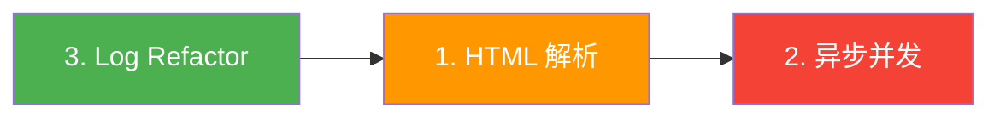

# 📧 Email Ingest — 优化 TODO

> 基于 2026-04-05 运行验证结果，规划三个核心优化方向。
> 按优先级排序，每个方向内的子任务按依赖顺序排列。

---

## 一、数据提取层：HTML 解析与附件解析（召回率升级）

> [!IMPORTANT]
> 当前 `email_fetcher.py:_extract_body()` 仅提取 `text/plain`。现代商业邮件（订单确认、航班行程单、银行对账单）大量使用纯 HTML 格式且不提供 text/plain fallback，导致 body 为空，LLM 收到的上下文严重缺失。

### 核心改动

- [x] **1.1 引入 `beautifulsoup4` + `lxml` 依赖**
  - 文件: [requirements.txt](file:///m:/workspace/antigravity/email_ingest/requirements.txt)
  - 添加 `beautifulsoup4` 和 `lxml`（解析器）

- [x] **1.2 重构 `_extract_body()` — 分层提取策略**
  - 文件: [email_fetcher.py](file:///m:/workspace/antigravity/email_ingest/modules/email_fetcher.py) `L113-L133`
  - 实现优先级链：
    1. 优先取 `text/plain` part（现有逻辑，保留）
    2. 若 `text/plain` 为空或不存在 → 取 `text/html` part，用 BS4 清洗为纯文本
    3. BS4 清洗规则：移除 `<script>`, `<style>`, `<head>` 标签，保留 `<a>` 的 href 文本
  - 新增私有方法 `_html_to_text(html: str) -> str`

- [x] **1.3 `content_hasher` 兼容性**
  - 文件: [content_hasher.py](file:///m:/workspace/antigravity/email_ingest/core/content_hasher.py)
  - 确认：hash 输入是 `email_data["body"]`（清洗后的纯文本），不依赖原始 HTML
  - 预期：无需改动，但需验证相同邮件 HTML→text 后的 hash 稳定性

- [x] **1.4 单元测试**
  - 文件: [test_email_fetcher.py](file:///m:/workspace/antigravity/email_ingest/tests/test_email_fetcher.py)
  - 新增测试用例：
    - `test_extract_body_html_only` — 仅含 `text/html` 的 multipart 邮件
    - `test_extract_body_prefers_plain` — 同时含 plain+html 时优先取 plain
    - `test_html_to_text_strips_scripts` — 验证 script/style 标签清除
    - `test_html_to_text_preserves_links` — 验证超链接文本保留

### 未来扩展（不在本轮）
- [ ] **1.5 多模态附件转发（Multimodal Attachment Forwarding）**
  - ~~原方案：本地 PyMuPDF 提取 PDF 文本~~ → 改为直接将附件二进制发送给支持多模态的 LLM（Gemini, GPT-4o）
  - 优势：无需本地解析库，对扫描件/表格/发票的理解能力远超纯文本提取
  - 需新增配置项：
    - `max_attachment_size_bytes: int = 5_000_000`（单附件上限，默认 5MB）
    - `max_attachment_tokens: int = 4000`（估算 Token 预算，防止单封邮件吃光额度）
    - `allowed_attachment_types: List[str] = ["application/pdf", "image/png", "image/jpeg"]`
  - 涉及文件: `email_fetcher.py`, `nlp_processor.py`, `config_loader.py`
- [ ] **1.6 内联图片 OCR**（可被 1.5 的多模态方案覆盖，暂缓独立实现）

---

## 二、并发性能与吞吐量提升（处理速度升级）

> [!IMPORTANT]
> 当前 NLP 处理为**强制串行同步**（`main.py:129` 的 `for email_data in emails_data` 循环）。第二次运行处理 24 封邮件耗时约 4 分钟（15:46:49 → 15:50:19），每封邮件平均 ~10s。引入受控并发可将吞吐量提升 3-5x。

### 核心改动

- [ ] **2.1 NLP Processor 异步化**
  - 文件: [nlp_processor.py](file:///m:/workspace/antigravity/email_ingest/modules/nlp_processor.py)
  - 将 `process_email()` 改为 `async def process_email()`
  - 将 `_call_llm()` 改为 `async def _call_llm()`
  - 使用 `openai.AsyncOpenAI` 替换 `openai.OpenAI`
  - `_throttle()` 改为 `asyncio.sleep()` 实现非阻塞等待

- [ ] **2.2 异步限流器（Semaphore + Token Bucket）**
  - 文件: [nlp_processor.py](file:///m:/workspace/antigravity/email_ingest/modules/nlp_processor.py)
  - 引入 `asyncio.Semaphore(max_concurrency)` 控制并发上限
  - 新增 `max_concurrency` 配置项
  - 文件: [config_loader.py](file:///m:/workspace/antigravity/email_ingest/core/config_loader.py)
  - 在 `LLMProviderConfig` 中添加 `max_concurrency: int = 5`

- [ ] **2.3 Main 编排层适配 asyncio**
  - 文件: [main.py](file:///m:/workspace/antigravity/email_ingest/main.py)
  - `main()` 改为 `async def main()`，入口使用 `asyncio.run(main())`
  - NLP 循环改为 `asyncio.gather()` + Semaphore 受控并发
  - 保持 Poison Pill 隔离逻辑：单个任务失败不影响其他并发任务
  - 游标更新逻辑不变：仍在**全部任务完成后**原子推进

- [ ] **2.4 缓存层线程安全**
  - 文件: [persistence.py](file:///m:/workspace/antigravity/email_ingest/core/persistence.py)
  - SQLite 在异步并发写入时需要 `check_same_thread=False`
  - 为 `put_cached_nlp` 添加 `asyncio.Lock()` 保护或使用 `aiosqlite`
  - 需评估：引入 `aiosqlite` 还是使用 executor wrapper

- [ ] **2.5 回归测试**
  - 确保所有现有测试在异步改造后仍通过
  - 新增并发场景测试：
    - `test_concurrent_nlp_respects_semaphore` — 验证并发不超过 max_concurrency
    - `test_concurrent_poison_pill_isolation` — 验证单封失败不阻塞其他

### 未来扩展（不在本轮）
- [ ] ~~**2.6 多邮件 Batch Prompting**~~ **⛔ 不推荐**
  - 经评估，Batch Prompting 存在严重的交叉幻觉（Cross-Contamination Hallucination）风险：
  - **实体归因错位**：模型会将邮件 A 的发件人/金额张冠李戴到邮件 B 的摘要中
  - **优先级互相干扰**：HIGH 安全警报与 SPAM 广告同框时，模型倾向于“中和”判断
  - **结构化输出映射不稳定**：多结果 JSON 数组中 summary 与 UID 的对应关系容易错位
  - 邮件分拣要求精确归因，性能优化应通过异步并发（2.1-2.4）而非 Prompt 合并来实现
- [ ] **2.7 多账户并行处理**（当前多账户是串行 for 循环）

---

## 三、Log Refactor（全链路可观测性）

> [!IMPORTANT]
> 日志是生产系统的"黑匣子"。当前日志在**进度追踪、限流感知、终止摘要**三个维度存在盲区，大批量处理时运维无法判断系统状态。

### P0：影响可观测性（必做）

- [x] **3.1 引入 Run Session ID**
  - 文件: [main.py](file:///m:/workspace/antigravity/email_ingest/main.py)
  - 在 `main()` 入口生成 8 字符 short UUID（如 `run_id = uuid4().hex[:8]`）
  - 注入到 logging format 中：`%(asctime)s [%(levelname)s] [%(run_id)s] %(name)s: %(message)s`
  - 或使用 `logging.LoggerAdapter` / `extra` dict

- [x] **3.2 启动参数回显（升级到 INFO）**
  - 文件: [main.py](file:///m:/workspace/antigravity/email_ingest/main.py) `L40`
  - 将 `logger.debug(f"Starting execution with args: {args}")` → `logger.info(...)`
  - 格式化为人类可读：`Pipeline started | accounts=1 dry_run=False format=console init_date=2026-04-05`

- [x] **3.3 IMAP 拉取完成日志**
  - 文件: [email_fetcher.py](file:///m:/workspace/antigravity/email_ingest/modules/email_fetcher.py) `L93` 之前
  - 新增 INFO 日志：`Fetch complete: {len(fetched_emails)} emails found, UID range {min}~{max}`

- [x] **3.4 NLP 单邮件进度日志**
  - 文件: [main.py](file:///m:/workspace/antigravity/email_ingest/main.py) `L129` 循环内
  - 新增 INFO 日志：`[{i}/{total}] Processing UID {uid} ...`
  - 成功后：`[{i}/{total}] UID {uid} → {priority} (cache_hit={bool})`

- [x] **3.5 限流等待升级为 INFO**
  - 文件: [nlp_processor.py](file:///m:/workspace/antigravity/email_ingest/modules/nlp_processor.py) `L59`
  - `logger.debug(...)` → `logger.info(f"Rate limit: waiting {sleep_time:.1f}s before next LLM call")`

- [x] **3.6 Pipeline 终止时打印运行摘要**
  - 文件: [main.py](file:///m:/workspace/antigravity/email_ingest/main.py) `L185` 之前
  - 收集并打印：
    ```
    ═══ Pipeline Summary ═══
    Accounts processed: 1
    Emails fetched:     24
    LLM calls made:     24  (cache hits: 0)
    Errors / Quarantine: 0
    Elapsed:            3m 30s
    ════════════════════════
    ```
  - 需要在 main 循环中累加计数器

### P1：降低噪音 / 提升精度

- [x] **3.7 NLP Cache HIT 降级为 DEBUG**
  - 文件: [nlp_processor.py](file:///m:/workspace/antigravity/email_ingest/modules/nlp_processor.py) `L97`
  - `logger.info(...)` → `logger.debug(...)`
  - 缓存命中信息已在 3.4 的进度日志中体现

- [x] **3.8 消除 NLP 错误双重打印**
  - 文件: [nlp_processor.py](file:///m:/workspace/antigravity/email_ingest/modules/nlp_processor.py) `L168`
  - 将 `logger.error(...)` → `logger.debug(...)`（保留用于调试追溯）
  - 保留 [main.py](file:///m:/workspace/antigravity/email_ingest/main.py) `L135` 的 `logger.error(...)` 作为唯一错误出口

- [x] **3.9 Cursor 日志增加变化量**
  - 文件: [main.py](file:///m:/workspace/antigravity/email_ingest/main.py) `L156`
  - 改为：`Cursor advanced for {account} from {before} → {after} (+{delta} emails)`

### P2：运维与账户追踪

- [x] **3.10 多账户处理增加序号**
  - 文件: [main.py](file:///m:/workspace/antigravity/email_ingest/main.py) `L64-65`
  - 改为：`== [{i}/{total}] Processing Account: xxx@gmail.com ==`

- [x] **3.11 第三方库日志降噪**
  - 文件: [main.py](file:///m:/workspace/antigravity/email_ingest/main.py) `L17` 附近
  - 添加：`logging.getLogger("httpx").setLevel(logging.WARNING)`
  - 消除 24 条 `HTTP Request: POST ... "HTTP/1.1 200 OK"` 的 INFO 刷屏

---

## 依赖关系与执行顺序



> [!TIP]
> **推荐执行顺序：3 → 1 → 2**
> - Log Refactor 改动最小、风险最低、立即改善开发体验
> - HTML 解析是独立的数据层改动，不影响架构
> - 异步并发是最大的架构变更，应在日志和数据层稳定后再进行
